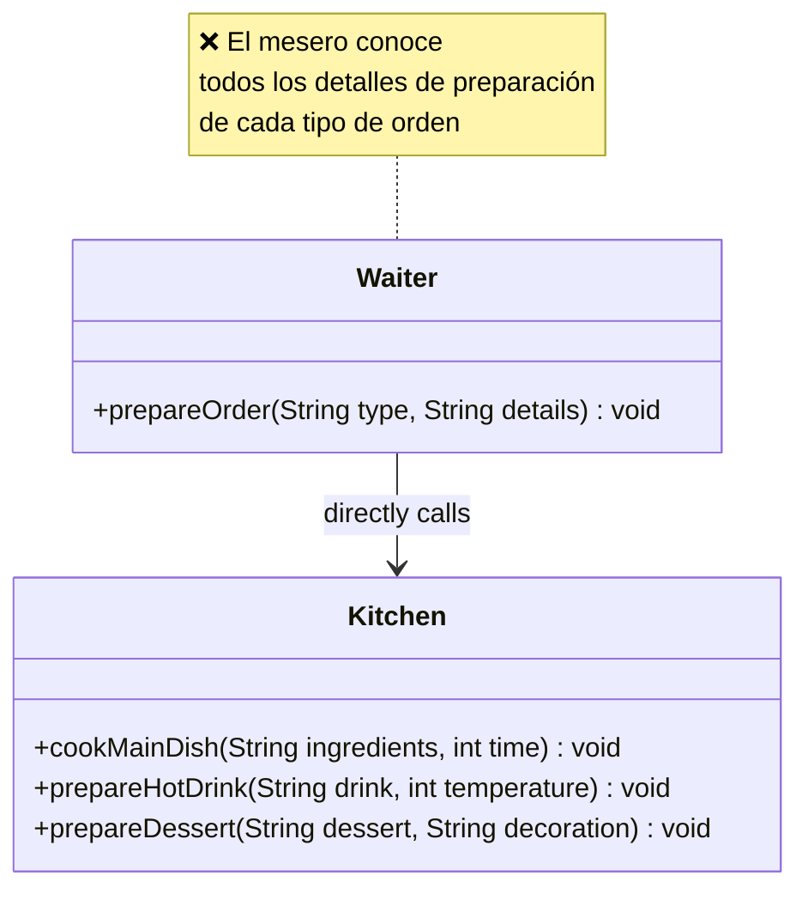
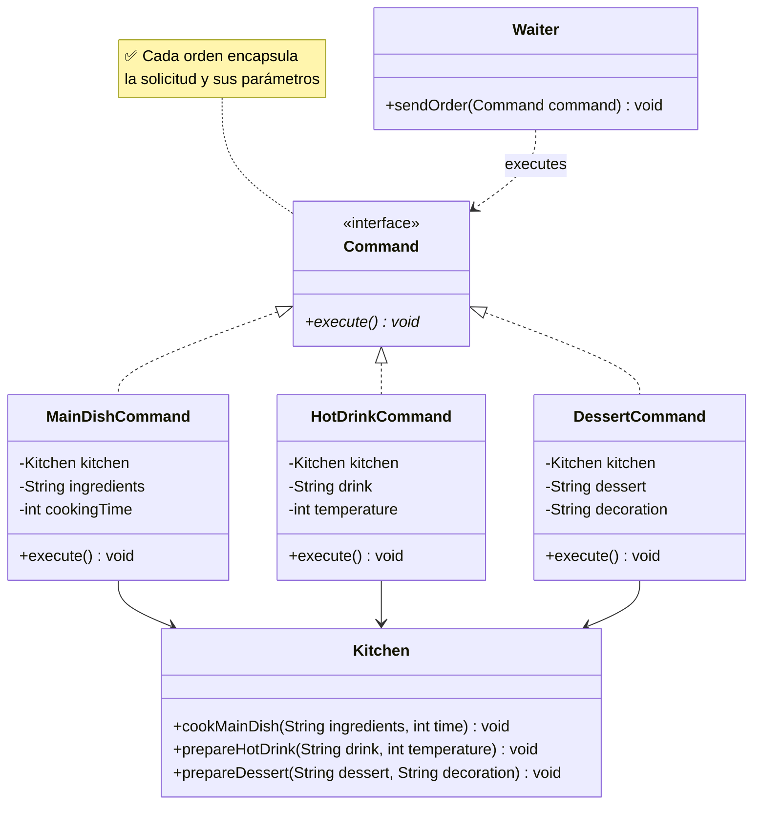
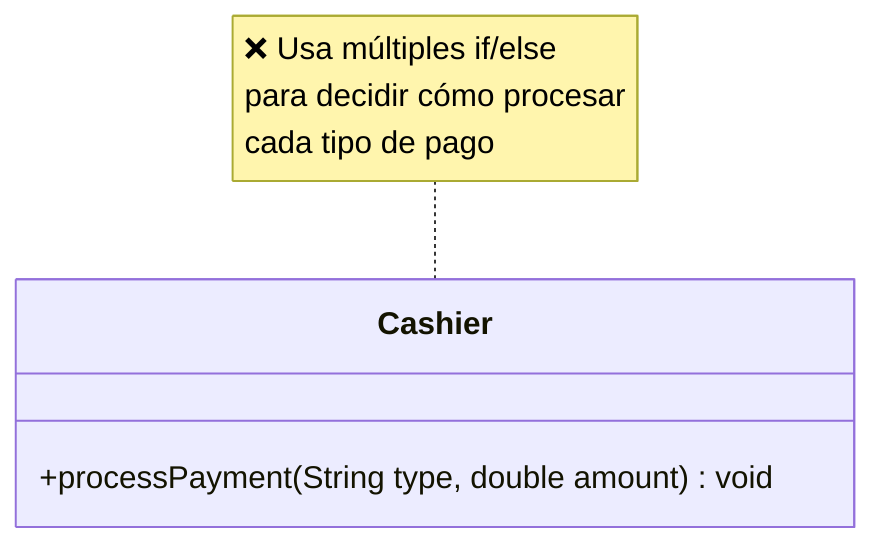
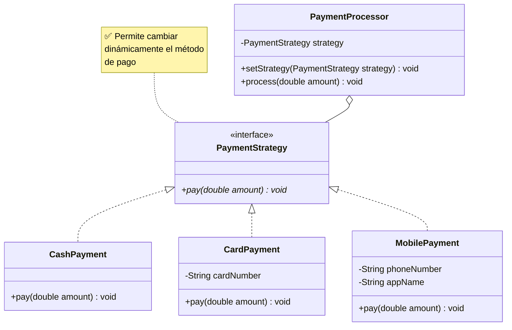

# Laboratorio 05: Patrones de Comportamiento

---

## Caso de Estudio: Sistema de Restaurante “QuickServe”

El restaurante QuickServe necesita modernizar distintos procesos de su operación para reducir errores y mejorar la mantenibilidad del sistema. Actualmente existen problemas en la gestión de órdenes de cocina y en el procesamiento de pagos debido al uso de lógica rígida y poco extensible.

---

## Preparación del Proyecto

1. Crea 2 paquetes:
    - `ejercicio01` - Command
    - `ejercicio02` - Strategy

---

# Ejercicio 1: Command Pattern

### 1) Diagrama del Código Actual (Problemático):

### 2) Diagrama de la Solución (Command):

#### **Implementa la solución creando:**

- `Command` (interface) con el método `execute()`.
- `MainDishCommand`, `HotDrinkCommand` y `DessertCommand`.
- `Kitchen` como receptor de las acciones.
- `Waiter` como invocador que ejecuta comandos.
- Agregar un nuevo comando (`SaladCommand` o similar) para demostrar extensibilidad.

---

# Ejercicio 2: Strategy Pattern

### 1) Diagrama del Código Actual (Problemático):

### 2) Diagrama de la Solución (Strategy):

#### **Implementa la solución creando:**

- `PaymentStrategy` (interface) con el método `pay(double amount)`.
- `CashPayment`, `CardPayment` y `MobilePayment`.
- `PaymentProcessor` que permita cambiar estrategias dinámicamente.
- Un cliente (`main`) que procese pagos usando diferentes estrategias.
- Agregar una nueva estrategia (`CryptoPayment` o similar) para demostrar extensibilidad.

---

## Entregables

Para cada ejercicio, presente:

1. Diagrama de clases UML con las relaciones correspondientes.
2. Implementación en Java de las clases principales.
3. Un ejemplo de uso (`main`) que demuestre el funcionamiento.

---

_Enfócate en entender por qué el código inicial es problemático antes de implementar la solución._